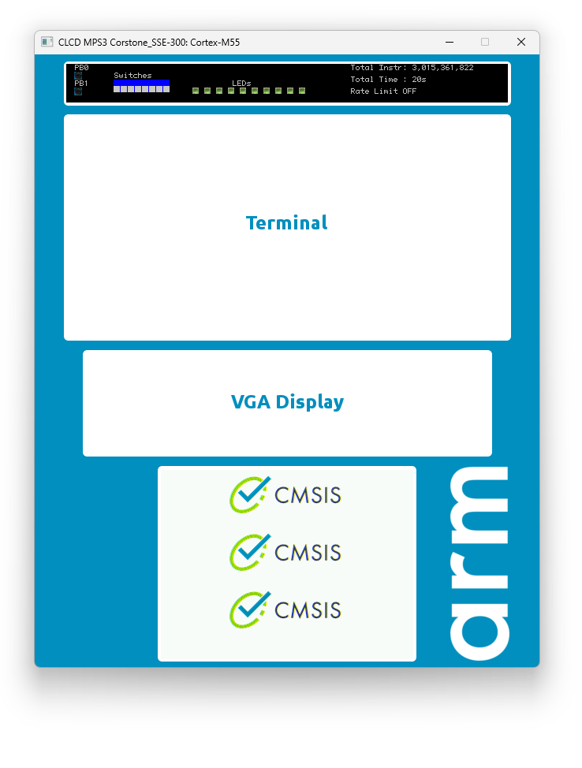

# MVE Example

This example implements an alpha-blending algorithm that are widely used in 2D image processing—**image-copying-with-an-alpha-mask**—as a case study. We provide three versions of the same algorithm: a pure C implementation, a Helium-accelerated version, and a Helium-ACI-accelerated version. The copied output is displayed on an LCD panel simulated by the FVP, allowing users to visually compare and inspect the effects of these three implementations. Additionally, the `__cycleof__()` function is used to measure the CPU cycle count for each version.

In the [White-Paper Innovate by Customized Instructions, but Without Fragmenting the Ecosystem](https://armkeil.blob.core.windows.net/developer/Files/pdf/white-paper/arm-custom-instructions-without-fragmentation-whitepaper.pdf), data shows that the MVE-ACI accelerated alpha-blending algorithm is 19x of the scalar implementation and 5.9x of the Helium accelerated implementation.

To simulate the ACI instruction set, **ACI-GetStarted** contains a makefile project that generates the corresponding [CDE(Custom Datapath Extension) plugin](https://developer.arm.com/documentation/100964/1127/Plug-ins-for-Fast-Models/CDE?lang=en)  using GCC. We also use an MDK project to show the firmware design flow. 

> [!NOTE]
>
> In addition to software simulation, this MDK project is based on [AN552 (which is the Arm® Corstone™ SSE-300 with Cortex®-M55 and Ethos™-U55: an example subsystem for MPS3)](https://developer.arm.com/documentation/dai0552/c/?lang=en), an FPGA image that runs on the MPS3 platform. [The Arm MPS3 FPGA prototyping board](https://developer.arm.com/Tools%20and%20Software/MPS3%20FPGA%20Prototyping%20Board) is a platform that allows designers to easily develop systems. For more information, please see [here](https://developer.arm.com/documentation/dai0552/c?lang=en). 
>
> The AN552 implements a Helium-ACI instruction set for RGB565 image processing; however, the corresponding Fast Model does **not** provide the simulation of these Helium-ACI instructions, so we need to add the Helium-ACI using the CDE-Plugin.


In the chip design, the functional verification of hardware logic—especially newly added ACI instructions—relies on dedicated **test benches**. These test benches use C-based test cases tailored for specific functionalities.

To facilitate development and validation of ACI-related firmware alongside hardware development, we provide a software environment in the **test** folder that allows direct execution of test bench test cases.

> [!CAUTION]
>
> It is important to note that **FVP is not a cycle-accurate simulation model**. While `__cycleof__()` relies on system hardware counters such as SysTick or PMU for cycle measurement, these counters themselves are software-simulated in FVP and do not guarantee cycle accuracy. Therefore, the performance measurements obtained during simulation should be considered only as **rough estimates** rather than definitive benchmarks.


## Steps to Custom Instruction

The following steps describe how to implement the `popc_u32` function as custom instruction. Each step is explained in more detail and in a related directory.

|  Step  | Description                                                  | Directory |
| :----: | :----------------------------------------------------------- | :-------- |
| **1.** | [Map custom instructions](#map-custom-instructions) to Custom Datapath Extension (CDE) | inc       |
| **2.** | [Create plugin for AVH-FVP simulation models](#create-avh-fvp-plugin) that adds custom instructions | plugin    |
| **3.** | [Create test code to validate](#create-test-code) the correctness of the AVH-FVP simulation | test      |
| **4.** | [Use custom instructions](#use-custom-instructions) in your algorithm to estimate performance gains | example   |

The steps for creating the processor hardware are not described here, but the test code created in step 3 can be reused also for hardware verification.

### Map Custom Instructions

The include file `./MVE/inc/aci_mve_lib.h` contains the ACI mapping for the `alpha-blending` instruction.  In this example, the `VCX3QA` intrinsic function is used with `ID=0` and `imm=0`. Further instructions may be defined with a different `imm` value.

The header file also defines the functions:

- `aci_init` to enable the related ACI accelerator.
    - It enables access in non-secure mode.


------

### Create AVH-FVP Plugin

The simulation of the `VCX3QA` instruction is implemented in the module `./MVE/plugin/cde_plugin.cpp` with the function `arm_2d_rgb565_aci_fvp::exec_vcx3_beatwise`.  For `accumulate=1` and `imm=1` the a simulation code for `arm_mix_rgb16_uint16x2` is called.

The plugin is generated using [GitHub workflows](../actions) for Linux and Windows. To download the plugin for local usage click on the related action (for example `Build CDE plugins for Windows AMD64`), select the latest workflow run. The DLL is located under **Artifacts**.

### Create Test Code

The test code verifies the execution of the `vblda7q_m_rgb565` instruction. This test may be reused later also for validation of the hardware implementation.

### Use Custom Instructions

To use the custom instruction, just all the function `vblda7q_m_rgb565` that is defined in the include file `./MVE/inc/aci_mve_lib.h`.


### Folder Structure

| Folder  | Description                                      |
| ------- | ------------------------------------------------ |
| example | the example project.                             |
| inc     | the folder containing ACI library header file(s) |
| src     | the folder containing ACI library source file(s) |
| plugin  | the CDE plugin makefile project                  |
| test    | test project                                     |


## Using the Example

To use the example on a local development computer with MDK uVision on Windows follow these steps:

### Step 1: Install the MDK

Please install the MDK version 5.42a or higher from the [www.keil.arm.com](https://www.keil.arm.com/)

> [!TIP]
>
> - The [Community Edition](https://www.keil.arm.com/mdk-community/) is sufficient and can be used **ONLY** for evaluation and non-commercial use.


> [!IMPORTANT]
>
> The MDK project utilizes the FVP with the CDE plugin for debugging.
>
> Starting from version 5.42, MDK provides **specially optimized FVPs and a CDE Loader** to enhance the user experience for ACI simulation. **Please ensure you have MDK v5.42 or later** when using ACI-GetStarted.


### Step 2: Download the CDE plugin for simulation

Open [github.com/arm-software/ACI-GetStarted - Actions](https://github.com/arm-software/ACI-GetStarted/actions) and select `Build CDE plugins for Windows AMD64`. Then open the latest workflow run and download the related DLL available under **Artifacts**.  

After downloading the cde plugin, please copy it to the `plugin/build` folder, where the default MDK project debug setting points to. 

```sh
... -C CDE.CDELoader.aci_object_files="[..\..\plugin\build\cde_plugin.dll]" ...
```

If you want to place it to a different place, please update the MDK project debug setting accordingly.

> [!TIP]
>
> If you want to build the cde plugin locally in windows, please see [here](../document/How_to_build_CDE_Plugins_Locally_in_Windows.md).


### Step 3: Open the MDK project

Navigate to the folder `project\mdk` and open the MDK project `ACI-Example.uvmpw`.

> [!NOTE]
>
> If this is the first time you open this project, MDK might ask you to install the missing cmsis-packs via the Pack-Installer. If you have trouble to install those packs in Pack-Installer, here are the links of the packs. You can download and install them manually:
>
> - Arm-2D: https://www.keil.arm.com/packs/arm-2d-arm/versions/
> - SSE-300-BSP: https://www.keil.arm.com/packs/v2m_mps3_sse_300_bsp-arm/boards/
> - perf_counter: https://www.keil.arm.com/packs/perf_counter-gorgonmeducer/versions/


### Step 2: Compile and Debug

You can compile the project by pressing `F7`. You should see no errors (and probably some warnings) in the **Build Output**:

```
".\Objects\ACI-Example.axf" - 0 Error(s), 0 Warning(s).
```

After that you can start a debug session by pressing `CTRL`+`F5`, you should see the **Corstone_SSE-300 Fast Model** windows as shown below:

 

In the **Debug (printf) View**, we can find the test report:

```c
ACI Example

-[Cycle Report]------------------------------------
Draw CMSIS Logo using C total cycle count: 379333 [0005c9c5]

-[Cycle Report]------------------------------------
Draw CMSIS Logo using Helium total cycle count: 75817 [00012829]

-[Cycle Report]------------------------------------
Draw CMSIS Logo using Helium-ACI total cycle count: 14373 [00003825]


```

> [!CAUTION]
>
> The Fast Model can only be used to verify the function correctness, and it is **NOT** cycle accurate. Any CPU cycle information obtained from the Fast Model can only provide **limited** and **rough references** at the **magnitude level**.


> [!NOTE]
>
> 1. The MDK project is configured to use `FVP_Corstone_SSE-300.exe` for debug. You can find it in `<Path for MDK>\ARM\avh-fvp\bin\models\` directory. 
> 2. You should build the CDE plugin first. The debug session will load it with the following command line:
>
>    ```shell
>    --plugin "$Karm\avh-fvp\plugins\CDELoader.dll" -C cpu0.has_cde=1 -C cpu0.cde_impl_name="ARM_2D_RGB565_ACI" -C CDE.CDELoader.aci_object_files="[..\..\plugin\build\cde_plugin.dll]" -C CDE.CDELoader.aci_parameters="COPRO=1" -C core_clk.mul=10000000
>    ```
>     Here we assume that you have installed the fast model in the default path.
>
> 3. The example code uses a keyword like macro `__cycleof__()` to measure the cycles the code uses inside the `{...}`. This macro comes from a software tool, `perf_counter`. It is an [open-source project on Github](https://github.com/GorgonMeducer/perf_counter) and available as a [cmsis-pack](https://www.keil.arm.com/packs/perf_counter-gorgonmeducer/versions/). 

For more details, please check the [CDELoader section of the Fast Model Reference Guide](https://developer.arm.com/documentation/100964/1127/Plug-ins-for-Fast-Models/CDELoader?lang=en). 
