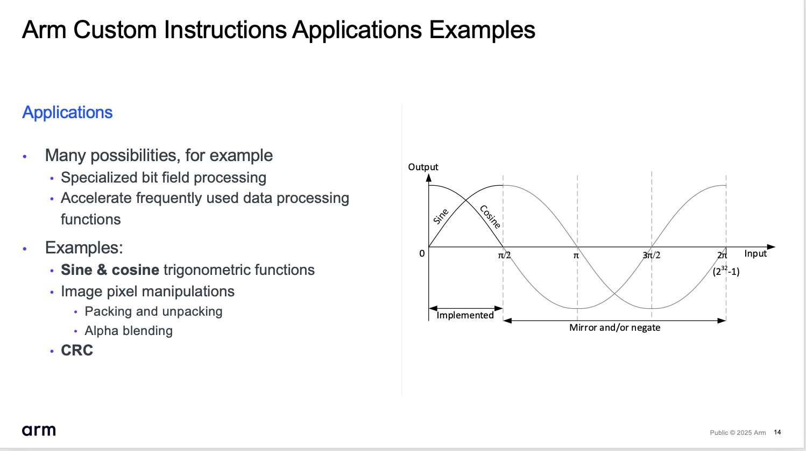
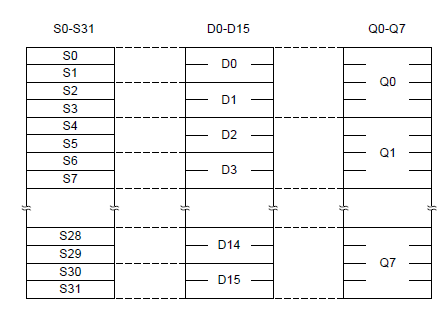

# Get Started with Arm Custom Instructions (ACI)

**[Arm Custom Instructions (ACI)](https://www.arm.com/technologies/custom-instructions)** extend Arm processors with application-specific instructions to optimize the performance of algorithms. ACI is currently implemented on Cortex-M33, Cortex-M52, Cortex-M55, and Cortex-M85 processors using the **Custom Datapath Extension (CDE)**. It extends the processor with a custom compute pipeline for accelerators that avoids the overhead of the co-processor interface.

## About this Repository

Imagine that you plan to accelerate a firmware with a set of custom instructions, but before proceeding to hardware design you would like to answer questions such as *"How can we accelerate our algorithm?"* There is usually more than one solution, and each solution corresponds to a set of custom instructions, so *which one is the best?*

This repository helps you to answer these questions by **evaluating your code using software simulation before the time-consuming hardware design**. It contains examples that you can adapt to your application requirements. These examples explain how ACI accelerated algorithms are developed by:

- Defining a set of custom instructions utilizing ACI.

- Adapt C/C++ source code to use ACI with intrinsic functions.

- Extend Arm simulation models with custom instructions and estimate the performance gains.

- Verify the ACI set before starting hardware design.

This repository **does not** include content related to hardware design. The details of the hardware interface for ACI are available in the *Integration and Implementation Manual of the Cortex-M processor* products. This document is available for licensees of the related Arm IP or under NDA (Non-disclosure agreement). If you wish to access this document, please contact the [Arm technical support team](https://www.arm.com/support/technical-support).

## Introduction Webinar

We plan for April 2025 an introduction webinar. Detailed information for registration will follow.
<!---
Watch this [introduction webinar](https://www.arm.com/resources/webinar/cmsis-solution) to learn about ACI and how to use it.
--->

## Technology Overview

Arm Custom Instructions (ACI, also known as Custom Datapath Extensions in the architecture specification) is an optional feature to allow chip designers to add custom data processing operations in their silicon products. Potentially this can provide higher performance and energy efficiency in certain specialized data processing tasks. Technical details are covered in the [**Introduction to the Arm Custom Instructions / Custom Datapath Extension**](./document/ACI_intro.md).

In addition the following resource pages are helpful:

- [White-Paper Arm Custom Instructions: Enabling
Innovation and Greater Flexibility on Arm](https://armkeil.blob.core.windows.net/developer/Files/pdf/white-paper/arm-custom-instructions-wp.pdf)
    - This paper was released shortly after Arm Custom Instructions was announced and provides a quick overview of what ACI is.
- [White-Paper Innovate by Customized Instructions, but Without Fragmenting the Ecosystem](https://armkeil.blob.core.windows.net/developer/Files/pdf/white-paper/arm-custom-instructions-without-fragmentation-whitepaper.pdf)
    - This paper was released for Embedded World 2012 and describes the capability of Arm Custom Instructions and how compilation toolchains support this feature.
- [Arm Custom Instructions on developer.arm.com](https://developer.arm.com/Architectures/Arm%20Custom%20Instructions)
    - Arm Custom Instructions webpage on the Arm website.

All C/C++ compilers that implement [Arm C Language Extension (ACLE) support CDE intrinsic functions to execute ACI](https://arm-software.github.io/acle/main/acle.html#custom-datapath-extension-1).

ACI access General Purpose Register (R0-R15) or the Vector Register file that contains 32-bit float register (S0-S31), 64-bit double registers (D0-D15), or 128-bit vector registers (Q0-Q7) as shown in the diagram below.

ACI Categories                | Register Access    | Notes
:-----------------------------|:-------------------|:------------------------------------------------
32-bit and 64-bit integer     | R0-R15             | float8/16/32 values can be passed using a C union.
32-bit single-precision float | S0-S31             | Only available when FPU extension is implemented.
64-bit double-precision float | D0-D15             | Only available when FPU extension with double precision float is implemented.
128-bit vector                | Q0-Q7              | Only available when [MVE (Helium)](https://www.arm.com/technologies/helium) is implemented.

## Example Projects

Introducing custom instructions is frequently an iterative process as algorithms might need adoptions to the underlying compute architecture. Exploring such algorithms on simulation models is an effective method to evaluate custom instructions on realistic compute workloads. This repository contains example projects that utilize this method of exploring ACI including the validation of the custom instruction extension. As these examples have a permissive open-source license they can be used a starting point for optimizing your own algorithms with ACI technology.

- [GPR](./GPR) implements a 32-bit integer [population count](https://blog.heycoach.in/population-count-algorithm-in-c/) custom instruction. The population count instruction is useful for many algorithms, for example to calculate the [Hamming weight](https://en.wikipedia.org/wiki/Hamming_weight).

- [MVE](./MVE) implements 128-bit vector instructions to accelerate algorithms for image and pixel manipulation. The custom instructions are may be used in the [Arm-2D](https://github.com/ARM-software/Arm-2D) image processing library and the example demonstrates the performance gain.

Each example project contains these directories:

Directory      | Description
:--------------|:----------------------------
example        | Uses custom instructions in real-world algorithms to estimate performance gains.
inc            | Include file that contains the CDE intrinsic function definitions.
plugin         | Arm Fast Model plugin that adds custom instructions to AVH-FVP models.
src            | Source file to access custom instructions in user applications.
test           | Tests to validate the correctness of the custom instructions.

## Required Tools

All popular C/C++ compilers for Arm Cortex-M processors implement [Arm C Language Extension (ACLE) support CDE intrinsic functions to execute ACI](https://arm-software.github.io/acle/main/acle.html#custom-datapath-extension-1). Code that is using ACI is portable between C/C++ compilers. Debuggers do not require extensions as ACI uses processor registers that are already visible in debug views.

Custom instructions [do not require changes to existing software or middleware](https://armkeil.blob.core.windows.net/developer/Files/pdf/white-paper/arm-custom-instructions-without-fragmentation-whitepaper.pdf). For example, any RTOS kernel with Cortex-M processor support will also work with devices that extend the processor with a set of ACI.

The example projects in this repository use the following tools:

- [Keil MDK](https://www.keil.arm.com/) with uVision IDE or VS Code extension pack to create application software.
- [CMSIS-Toolbox](https://open-cmsis-pack.github.io/cmsis-toolbox/) for command-line build.
- [AVH-FVP](https://arm-software.github.io/AVH/main/overview/html/index.html) simulation models for Cortex-M processors (uses Arm Fast Models).
- [GCC Compiler](https://packages.msys2.org/packages/mingw-w64-x86_64-gcc) and [Make](https://packages.msys2.org/packages/mingw-w64-x86_64-make) to translate plugins for AVH-FVP simulation models on Linux or Windows Hosts.

## GitHub Actions

The repository uses GitHub [Actions](../../actions) to generate the plugins and verify examples and tests.

Action         | Description
:--------------|:----------------------
[build-plugins-linux.yml](./.github/workflows/build-plugins-linux.yml) | Generate the AVH-FVP plugin extensions for the ACI examples. [Download plugin artifact for Linux](../../actions/workflows/build-plugins-linux.yml).
[build-plugins-windows.yml](./.github/workflows/build-plugins-windows.yml) | Generate the AVH-FVP plugin extensions for the ACI examples. [Download plugin artifact for Windows](../../actions/workflows/build-plugins-windows.yml).
[GPR-test.yml](./.github/workflows/GPR-test.yml)  | Validation of AVH-FVP plugin for GPR ACI extension.
[GRP-example.yml](./.github/workflows/GPR-example.yml) | Build and execution test for GPR example project.
[MVE-test.yml](./.github/workflows/MVE-example.yml)  | Validation of AVH-FVP plugin for MVE ACI extension.
[MVE-example.yml](./.github/workflows/MVE-example.yml) | Build and execution test for MVE example project.

## Related

### Arm Custom Instructions - Technology

- [White-Paper Arm Custom Instructions: Enabling
Innovation and Greater Flexibility on Arm](https://armkeil.blob.core.windows.net/developer/Files/pdf/white-paper/arm-custom-instructions-wp.pdf)
- [White-Paper Innovate by Customized Instructions, but Without Fragmenting the Ecosystem](https://armkeil.blob.core.windows.net/developer/Files/pdf/white-paper/arm-custom-instructions-without-fragmentation-whitepaper.pdf)
- [Arm Custom Instructions on developer.arm.com](https://developer.arm.com/Architectures/Arm%20Custom%20Instructions)

### Cortex-M Processor - Technical Information

- [Cortex-M33](https://developer.arm.com/Processors/Cortex-M33)
- [Cortex-M52](https://developer.arm.com/Processors/Cortex-M52)
- [Cortex-M55](https://developer.arm.com/Processors/Cortex-M55)
- [Cortex-M85](https://developer.arm.com/Processors/Cortex-M85)
- [Arm Helium Technology](https://github.com/arm-university/Arm-Helium-Technology/blob/main/HeliumTechnology_referencebook.pdf)

### Software Development Tools

- [Arm C Language Extension (ACLE) support CDE intrinsic functions to execute ACI](https://arm-software.github.io/acle/main/acle.html#custom-datapath-extension-1)
- [Arm Fast Models - Plugin for CDE](https://developer.arm.com/documentation/100964/1127/Plug-ins-for-Fast-Models/CDE)

### Hardware IP

- [Arm Flexible Access](https://www.arm.com/products/flexible-access)
- [Arm Flexible Access for Startups](https://www.arm.com/products/flexible-access/startup)

## License

The example projects in this repository are licensed under .

## Issues

Please feel free to raise an [issue on GitHub](https://github.com/ARM-software/ACI-GetStarted/issues)
to report misbehavior (i.e. bugs) or start discussions about enhancements. This
is your best way to interact directly with the maintenance team and the community.
