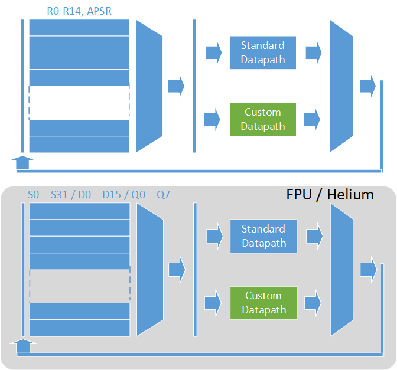
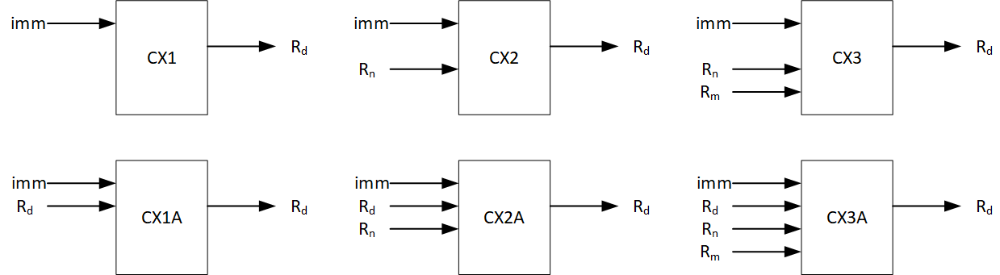
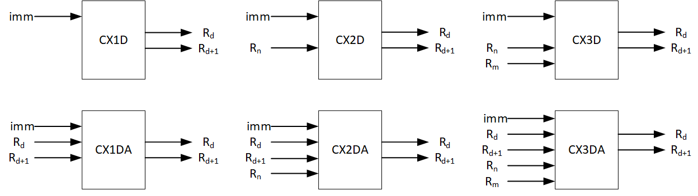
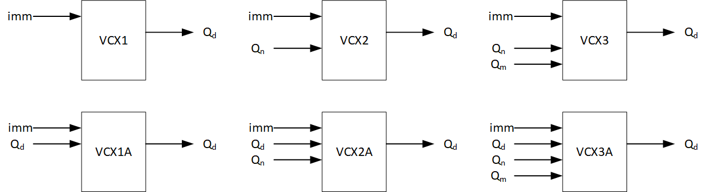
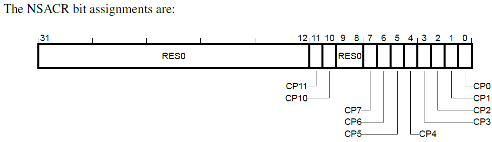
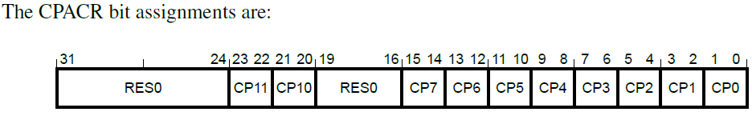
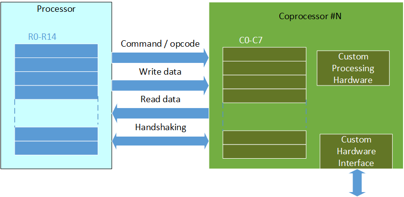

# Introduction to the Arm Custom Instructions / Custom Datapath Extension

## Background

With the increasing demand for computing power in microcontrollers and deeply embedded systems, it is common for MCU/SoC designers to integrate hardware accelerators to speed up specialized processing tasks. With Arm Cortex-M processors, there are three ways to achieve this:

- Memory mapped hardware accelerators connected to the bus interconnect
- Hardware accelerators connected to the coprocessor interface of the processor
- Hardware accelerators integrated inside the processor using the Arm Custom Instructions

The Cortex-M processors supporting these features are listed below:

|Feature|List of Cortex-M processors with the feature|
|---|---|
|Memory mapped hardware accelerators|All Cortex-M processors|
|Coprocessor interface|Cortex-M33, Cortex-M35P, Cortex-M52, Cortex-M55, Cortex-M85|
|Arm Custom Instructions (also known as the Custom Datapath Extension)|Cortex-M33, Cortex-M52, Cortex-M55, Cortex-M85|

Table 1: Support of hardware acceleration in the Cortex-M processor family

The Arm Custom Instructions (ACI) is a relatively new feature. It was announced in Arm TechCon in 2019. In Arm documentation (e.g. Armv8-M Architecture Reference Manual), the Arm Custom Instructions feature is often referred as Custom Datapath Extension (CDE).

- Arm Custom Instructions (ACI) is an Arm brand name of the feature
- Custom Datapath Extension (CDE) is a technical name of the instruction set extension defined in the Armv8-M architecture. This name can be used with Arm designed processors as well as processors designed by Arm architecture licensees.

Unlike the memory mapped hardware accelerator and coprocessor mechanisms, the ACI use the processor’s registers as data processing inputs and outputs. These registers can be:

- R0 to R14 and ALU flags in the standard register bank
- S0 to S31 / D0 to D15 / Q0 to Q7 in the register bank of the Floating-Point Unit (FPU) / Extension Processing Unit (EPU).
  - Notes:
    - Support for D0 to D15 format is available only if the processor supports double precision floating-point processing.
    - Support for Q0 to Q7 format is available only if the processor support M-profile Vector Extension (MVE, also known as Helium Technology).

The key advantages of using ACI when compared to coprocessor or memory mapped hardware accelerator are:

- Potentially lower data processing latency
- No need to add additional code to support context switching

The potential benefit of lower data processing latency can be demonstrated using a simple population count example (i.e. counting the number of bits that are set to 1 in a register).

Without any hardware acceleration, the standard algorithm takes around 25 clock cycles:

```
mov.w   r1, #0x55555555
and.w   r1, r1, r0, lsr #1
subs    r0, r0, r1
mov.w   r1, #0x33333333
and.w   r1, r1, r0, lsr #2
bic     r0, r0, #0xCCCCCCCC
add     r0, r1
mov.w   r1, #0x01010101
add.w   r0, r0, r0, lsr #4
bic     r0, r0, #0xF0F0F0F0
muls    r0, r1, r0
lsrs    r0, r0, #24
...
```

With memory mapped hardware acceleration, the operation could be reduced to around 4 clock cycles<br> (assuming there is 1 stall cycle between the first and second instructions due to the nature of the AHB pipeline):

```
; Load address
ldr    r0, =hw_base_address
str    r1,[r0,#offset] ;write input
ldr    r1,[r0,#offset] ;read result
```

When using hardware with the coprocessor interface, the operation could be reduced to 2 clock cycles:

```
; Write input
mcr   CPn, Opc1, Rt, CRn, CRm{, Opc2}
; read result
mrc   CPn, Opc1, Rt, CRn, CRm{, Opc2}
```

When using Arm Custom Instructions to implement hardware acceleration, the operation could be completed in a single clock cycle:

```
; Compute population count
cx2   CPn, Rd, Rn, #imm
```

While moving from two clock cycles to one does not seems to be a lot of change, it can make a big different when the operation need to be repeated millions of times.

ACI can be used in many applications. For example:

- Mathematic calculations
- Cryptography
- Data processing in machine learning
- Processing of image pixels 

Some of these examples are illustrated in the paper [Innovate by Customized Instructions, but without fragmenting the ecosystem](https://armkeil.blob.core.windows.net/developer/Files/pdf/white-paper/arm-custom-instructions-without-fragmentation-whitepaper.pdf)

## About the Arm Custom Instructions

### Important concepts

#### ACI is optional

Arm Custom Instructions is an optional feature, and is free to Arm customers using the Cortex-M33/M52/M55/M85 processors. However, many Cortex-M33/M52/M55/M85 devices does not implement this feature because the instruction set supported by these processors are already very comprehensive.

#### ACI is architecturally defined

The format and binary encoding of the Arm Custom Instructions are defined in the [Armv8-M Architecture Reference Manual](https://developer.arm.com/documentation/ddi0553/latest/). However, what data processing are carried out for each of these instructions are defined by silicon vendors. You can think of these instructions as placeholder or template of custom defined data processing functions.

#### Supported features

The Arm Custom Instructions support the following features:

- Single cycle or multi-cycle operations
  - If an interrupt arrives during the middle of a multi-cycle ACI instruction, the ACI instruction can be abandoned and restarted after the interrupt service is completed. As a result, it does not affect interrupt latency.
  - Can execute back-to-back (subject to pipeline hazards)
- Immediate data value to support the definition of multiple instructions.
- Support for decode error (handled by UsageFault or HardFault) 
- Access permission control
  - If the processor is configured with TrustZone security extension, each of the ACI accelerator can be programmed by Secure privileged software as either Secure access only, or accessible to both Secure or Non-secure worlds. (Please refers to NSACR Non-secure Access Control Register for more information).
  - Privileged software can configure the ACI accelerator as disabled, privileged access only, or accessible by both privileged and unprivileged software. (Please refers to the CPACR Coprocessor Access Control Register for more information).
- If the processor is configured with function safety features, the ACI interface can also include fault detection capability for functional safety. Please refer to the Integration and Implementation Manual of the Cortex-M processor product for further information. (This document is available to Arm customers or under NDA).

#### ACI uses processor's registers for data processing

The instructions in Arm Custom Instructions use the processor's internal registers for data processing. These can be:

- R0-R14, flags in the APSR (Application Program Status Register)
- S0-S31 (if FPU is supported), D0-D15 (if FPU is present and double precision float is supported), Q0-Q7 (if Helium/M-profile Vector Extension is supported).

 

#### ACI restrictions

##### Registers

The Stack Pointer (R13) and Program Counter (R15) cannot be used as input/output of integer ACI instructions.
The flags in the Floating-Point Status and Control Register (FPSCR) cannot be used as input/output of the floating-point ACI instructions. However, the ALU flags in the integer pipeline (i.e. APSR) can be used as input/output for integer ACI instructions.

##### Architectural states

While the custom datapath can contain sequential logic elements (i.e. flip-flops), it should not contain registers that hold architectural state(s) across instruction boundary. There are multiple reasons for this restriction:

- If an interrupt occurred during the execution of a custom instruction, potentially the instruction could get abandoned and will restart after the interrupt is serviced. If the custom datapath logic contain architectural state, the execution result could be incorrect if the internal architectural state is used as an input.
- The internal architectural state might contain confidential information that should not be exposed to another software context. If a context switch occurred and a different software context execute a custom instruction that access such architectural state, the confidential information could leak or be modified, thus resulting in security issues.
- There is no debug mechanism to access internal architectural states. Therefore debugging can be very difficult if such architectural state is present.

If internal architectural states are required, the coprocessor interface features can be used instead. Coprocessors are hardware accelerators that are outside of the processor but are closely coupled to the Cortex-M processor via a coprocessor interface. Coprocessors have their own internal registers and can have additional hardware interface to other hardware.

##### Floating-point feature support

ACI instructions support floating-point data processing but does not support direct access to the FPSCR (Floating-Point Status and Control Register). As a result, ACI instructions cannot access or modify the N-Z-C-V flags, or the exception flags (IDC, IXC, UFC, OFC, DZC, IOT) for the floating-point unit.

#### Multiple ACI accelerators and multiple ACI instructions

The current Cortex-M33/M52/M55/M85 processor designs support up to EIGHT custom accelerators. Each of them can be an Arm Custom Instructions accelerator, or a Coprocessor accelerator. Each accelerator can support multiple custom instructions / coprocessor commands. Each accelerator is assigned with an ID of #0 to #7 - The values are defined by the chip designers. Each instruction for the Arm Custom Instructions or coprocessor need to specify the ID value so that the correct accelerator is selected.

Accelerators based on Arm Custom Instructions and Coprocessor can co-exist, providing that they are assigned with different ID values.

#### ID for Arm Custom Instructions and Coprocessors

Architecturally the ID field in the Arm Custom Instructions and Coprocessor Instructions have 4-bit wide. However, only #0 to #7 are available for custom accelerator hardware. #8 to #15 are reserved for Arm internal use. For example, #10 and #11 are reserved for the Floating-Point Unit/Helium.

The ID values are also used for control/configuration of the accelerators. A number of programmable registers are available for these functions, and they contain bit fields for each of the custom accelerators. For example:

|Register|Function|Default|
|---|---|---|
|CPACR|Enable/Disable each of the accelerators|Disabled|
|NSACR|Configure each accelerator as Secure or Non-secure (available only when the TrustZone security extension is implemented)|Secure|
|CPPWR|Allowing or disallowing an accelerator to powered down. |Disallowed - i.e. the accelerator power is ON.|

Table 2: Programmable registers related to the operations of the Arm Custom Instructions and coprocessors

#### Toolchain support

The Arm C Language Extension (ACLE) defines C intrinsic functions to enable software developers to access the Arm Custom Instructions as easy as calling C functions. The ACLE is supported by multiple toolchains (e.g. Arm Compiler, GCC, LLVM and others). As a result, the C/C++ codes are portable across multiple toolchains, and it is not necessary to modify the C/C++ compilers.

#### Toolchain options

When using the Arm Custom Instructions, you must provide the configuration details to the toolchain - i.e. the IDs for Arm Custom Instructions. The compiler and binary utilities in the toolchains provide command line options for this purpose.

### The Arm Custom Instructions

#### The instructions

There are 15 types of instructions defined in the Custom Datapath Extension (CDE) in the Armv8-M architecture reference manual. They are divided into

- 5 data types (32-bit integer, 64-bit integer, 32-bit floating-point (fp32), 64-bit floating-point (fp64), 128-bit vector)
- Various numbers of inputs

The instructions are listed below, where:

- Pn is the ACI/coprocessor number (0 to 7)
- Rd/Rn/Rm are integer registers / General Purpose Registers (GPR)
- NZCV are ALU flags
- Sd/Sn/Sm are 32-bit floating-point registers
- Dd/Dn/Dm are 64-bit floating-point registers
- Qd/Qn/Qm are 128-bit vectors

|INSTRUCTION|ASSEMBLY|INPUTS|OUTPUTS|
|---|---|---|---|
||General-purpose registers and NZCV flags|
|CX1{A}|CX1{A}  Pn, Rd,#imm|Immediate (13bit) and 1x 32-bit GPR/NZCV {same as output}|1x 32-bit GPR or NZCV|
|CX2{A}|CX2{A} Pn, Rd,Rn,#imm|Immediate (9bit) and 2x 32-bit GPR/NZCV {one same as output}|1x 32-bit GPR or NZCV|
|CX3{A}|CX3{A} Pn, Rd,Rn,Rm,#imm|Immediate (6bit) and 3x 32-bit GPR/NZCV {one same as output}|1x 32-bit GPR or NZCV|
|CX1D{A}|CX1D{A} Pn, Rd, Rd+1, #imm|Immediate (13bit) and 1x 32-bit GPR/NZCV {two same as output}|2x 32-bit GPR|
|CX2D{A}|CX2D{A} Pn, Rd, Rd+1, Rn, #imm|Immediate (9bit) and 2x 32-bit GPR/NZCV {two same as output}|2x 32-bit GPR|
|CX3D{A}|CX3D{A} Pn, Rd,Rd+1, Rn, Rm, #imm|Immediate (6bit) and 3x 32-bit GPR/NZCV {two same as output}|2x 32-bit GPR|
||Floating-point / Vector registers|||
|VCX1{A}|VCX1{A} Pn, Sd,#imm|Immediate (11bit) and 1x 32-bit fp32 register {same as output}|1x 32-bit fp32 register|
|VCX2{A}|VCX2{A} Pn, Sd,Sn,#imm|Immediate (6bit) and 2x 32-bit fp32 register {one same as output}|1x 32-bit fp32 register|
|VCX3{A}|VCX3{A} Pn, Sd, Sn, Sm, #imm|Immediate (3bit) and 3x 32-bit fp32 register {one same as output}|1x 32-bit fp32 register|
|VCX1{A}|VCX1{A} Pn, Dd,#imm|Immediate (11bit) and 1x 64-bit fp64 register {same as output}|1x 64-bit fp64 register|
|VCX2{A}|VCX2{A} Pn, Dd, Dn, #imm|Immediate (6bit) and 2x 64-bit fp64 register {one same as output}|1x 64-bit fp64 register|
|VCX3{A}|VCX3{A} Pn, Dd, Dn, Dm, #imm|Immediate (3bit) and 3x 64-bit fp64 register {one same as output}|1x 64-bit fp64 register|
|VCX1{A}|VCX1{A} Pn, Qd, #imm|Immediate (12bit) and 1x 128-bit vector register {same as output}|1x 128-bit vector register|
|VCX2{A}|VCX2{A} Pn, Qd,Qn,#imm|Immediate (7bit) and 2x 128-bit vector register {one same as output}|1x 128-bit vector register|
|VCX3{A}|VCX3{A} Pn, Qd, Qn, Qm, #imm|Immediate (4bit) and 3x 128-bit vector register {one same as output}|1x 128-bit vector register|

Table 3: List of Arm Custom Instructions (instructions covered by the Custom Datapath Extension)

For each instruction, there is

- a coprocessor number (0 to 7)
- destination register (can be flags)
- source register(s) (can also be flags) 
- an immediate data value

For example, with the following instruction:

 

For each class of instruction, there is also an "Accumulative" variant, noted by the A suffix. Accumulative variant means that the destination register is also an input of the data processing operation. While the term accumulative is used, it does not necessarily imply an "addition" of the previous value involved in the processing, but any operator implemented by the custom instruction.

The support of these instructions depends on the processor's configuration:

|INSTRUCTIONS|Cortex-M33|Cortex-M52/M55/M85|
|---|---|---|
|CX1{A}  Pn, Rd,#imm<br>CX2{A} Pn, Rd,Rn,#imm<br>CX3{A} Pn, Rd,Rn,Rm,#imm|Optional|Optional|
|CX1D{A} Pn, Rd, Rd+1, #imm<br>CX2D{A} Pn, Rd, Rd+1, Rn, #imm<br>CX3D{A} Pn, Rd,Rd+1, Rn, Rm, #imm|Optional|Optional|
|VCX1{A} Pn, Sd,#imm<br>VCX2{A} Pn, Sd,Sn,#imm<br>VCX3{A} Pn, Sd, Sn, Sm, #imm|Optional and available only if the FPU is included.|Optional and available only if the FPU is included.|
|VCX1{A} Pn, Dd,#imm<br>VCX2{A} Pn, Dd, Dn, #imm<br>VCX3{A} Pn, Dd, Dn, Dm, #imm|Not available|Optional and available only if the FPU is included and support FP64.|
|VCX1{A} Pn, Qd, #imm<br>VCX2{A} Pn, Qd,Qn,#imm<br>VCX3{A} Pn, Qd, Qn, Qm, #imm|Not available|Optional and available only if Helium is implemented.|

Table 4: Supported CDE instructions in Cortex-M processors

#### Illustrations of inputs and outputs

As mentioned in section [The Instructions](#the-instructions), the architecture defines the encoding of the instructions and how that maps to the inputs and outputs, but the data processing functions within the instructions are defined by chip designers. You can view the Arm Custom Instructions are a range of placeholders.

Arm Custom Instructions with 32-bit inputs and outputs
 

Arm Custom Instructions with 32-bit and 64-bit inputs, and 64-bit outputs

Note: The "d" in Rd must be an even number range from 0 to 10 because SP(R13) and PC(R15) cannot be used.
 

Arm Custom Instructions with single precision floating-point (fp32) inputs and outputs (available only when a floating-point unit is implemented)

 

Arm Custom Instructions with double precision floating-point (fp64) inputs and outputs (available only when a double precision floating-point unit is implemented)

 

Arm Custom Instructions with 128-bit vectors as inputs and outputs (available only when Helium / M-profile Vector Extension is implemented)

 

#### Use of ALU flags

For the integer (32-bit and 64-bit) Arm Custom Instructions, the input and output registers can be ALU flags (NZCV) using encoding value of 15. It means that the R15 (Program Counter) cannot be used as input or output of Arm Custom Instructions. Floating-point and Vector ACI instructions does not support flags. Additionally, R13 (Stack Pointer) cannot be used either.

When using ALU flags in Arm Custom Instruction, the assembly symbol is "APSR_nzcv".

#### Defining multiple instructions

Each of the ACI instructions supports an immediate data value. This can be used to specify different operations. For example, the immediate data bit field in the CX3 instruction is 6-bit wide, so you can have up to 2^6 = 64 different CX3 operations. In many cases, the number of supported operations is much smaller, so only need a few bits for the "op-code" definition. Chip designers could use the unused bits in the bit field as an extra parameter for the operation.

## Software development with the Arm Custom Instructions

### Software development overview

To enable software developers to access to Arm Custom Instructions features easily, intrinsic functions are defined in the [Arm C Language Extension (ACLE)](https://developer.arm.com/architectures/system-architectures/software-standards/acle).

Using these intrinsic functions, you can access to an Arm Custom Instructions just like calling C functions.  The ACLE standard is supported in multiple compilers (e.g. Arm Compiler, GCC, LLVM, IAR). Therefore, codes created are portable between multiple toolchains. There is no need to customize the C compiler to use the Arm Custom Instructions. But software developers need to provide command line option to inform the compilation toolchain which accelerator ID values are mapped to Arm Custom Instructions.

Please note that the coprocessor instructions are also supported with intrinsic functions defined in the ACLE.

### Setup

#### C/C++ Header file

To use the intrinsic functions for Arm Custom Instructions, the C/C++ code should include the ACLE header:

```
#include "arm_cde.h"
```

#### Configuration registers

Before using an Arm Custom Instructions, the hardware accelerator must be enabled, and software need to have the right access permission. These involve the setup of several programmable registers:

- Secure privileged software needs to setup access permission of an ACI/CDE accelerator using the Non-secure Access Control Register (NSACR)
  - The CMSIS-CORE symbol of NSACR is SCB->NSACR
  - For each bit in the register, 0=Secure (default), 1=Non-secure

 

- Privileged software needs to enable the ACI/CDE accelerator using the Coprocessor Access Control Register (CPACR).
  - The CMSIS-CORE symbol of CPACR is SCB->CPACR
  - For each bit field in the register, 00=disabled (default), 01=privileged access only, 11=full access

 

-	Privileged software needs to make sure that the Coprocessor Power Control Register (CPPWR) is set to be powered up (default). (Note: There is no support for separate power domains for ACI/CDE in the existing Cortex-M processors. But it is possible for a future Cortex-M processor to support this. Today, this register is more applicable to coprocessor accelerators which could have separated power domains.) This register contains two types of bit fields:
  - SU[n]: if set to 1, specify the ACI/Coprocessor is permitted to enter a non-retentive power state. By default this bit is 0.
  - SUS[n]: if set to 1, the SU[n] bit field is Secure access only.

#### Toolchain options

In Arm Compiler 6.14.1 or after, there are new command line options for armclang to enable the use of Arm Custom Instructions. For example:

Armv8-M

- "--target=arm-arm-none-eabi -march=armv8-m.main+cdecp*N*"
- "--target=arm-arm-none-eabi -mcpu=cortex-m33+cdecp*N*"

Armv8.1-M

- "--target=arm-arm-none-eabi -march=armv8.1-m.main+cdecp*N*"
- "--target=arm-arm-none-eabi -mcpu=cortex-m55+cdecp*N*"

Where *N* is in the range 0-7, for an Armv8-M / Armv8.1-M target with the Main Extension.
There is also a new command line option for fromelf:

- "--coproc*N*=*value*"

where *N* is coprocessor ID in the range of 0 to 7, *value* = cde or generic (upper case CDE also allowed).

Note: You MUST use "--cpu" option with "--coproc*N*=value"

In GCC, similar option is available from GCC 10 (Q4-2020)

- "-march=armv8-m.main+cdecp*N* –mthumb"
- "-march=armv8-m.main+fp+cdecp*N* –mthumb"
- "-march=armv8.1-m.main+mve+cdecp*N* –mthumb"

### Using the intrinsic functions

#### ACLE specification

The Arm C Language Extension (ACLE) specifications can be found in these locations: https://arm-software.github.io/acle/ and https://github.com/ARM-software/acle

This repository contains multiple specifications, and the ACLE intrinsic functions for the Custom Datapath Extension (CDE) can be found in https://arm-software.github.io/acle/main/acle.html#custom-datapath-extension-1 

Here we listed the function prototypes:

**Intrinsic functions for 32-bit integer CDE instructions**

|Instruction|Intrinsic function|
|---|---|
|CX1|uint32_t __arm_cx1(int coproc, uint32_t imm);|
|CX1A|uint32_t __arm_cx1a(int coproc, uint32_t acc, uint32_t imm);|
|CX2|uint32_t __arm_cx2(int coproc, uint32_t n, uint32_t imm);|
|CX2A|uint32_t __arm_cx2a(int coproc, uint32_t acc, uint32_t n, uint32_t imm);|
|CX3|uint32_t __arm_cx3(int coproc, uint32_t n, uint32_t m, uint32_t imm);|
|CX3A|uint32_t __arm_cx3a(int coproc, uint32_t acc, uint32_t n, uint32_t m, uint32_t imm);|

**Intrinsic functions for 64-bit integer CDE instructions**

|Instruction|Intrinsic function|
|---|---|
|CX1D|uint64_t __arm_cx1d(int coproc, uint32_t imm);|
|CX1DA|uint64_t __arm_cx1da(int coproc, uint64_t acc, uint32_t imm);|
|CX2D|uint64_t __arm_cx2d(int coproc, uint32_t n, uint32_t imm);|
|CX2DA|uint64_t __arm_cx2da(int coproc, uint64_t acc, uint32_t n, uint32_t imm);|
|CX3D|uint64_t __arm_cx3d(int coproc, uint32_t n, uint32_t m, uint32_t imm);|
|CX3DA|uint64_t __arm_cx3da(int coproc, uint64_t acc, uint32_t n, uint32_t m, uint32_t imm);|

**Intrinsic functions for 32-bit FPU CDE instructions**

|Instruction|Intrinsic function|
|---|---|
|VCX1|uint32_t __arm_vcx1(int coproc, uint32_t imm);|
|VCX1A|uint32_t __arm_vcx1a(int coproc, uint32_t acc, uint32_t imm);|
|VCX2|uint32_t __arm_vcx2(int coproc, uint32_t n, uint32_t imm);|
|VCX2A|uint32_t __arm_vcx2a(int coproc, uint32_t acc, uint32_t n, uint32_t imm);|
|VCX3|uint32_t __arm_vcx3(int coproc, uint32_t n, uint32_t m, uint32_t imm);|
|VCX3A|uint32_t __arm_vcx3a(int coproc, uint32_t acc, uint32_t n, uint32_t m, uint32_t imm);|

**Intrinsic functions for 64-bit FPU CDE instructions**

|Instruction|Intrinsic function|
|---|---|
|VCX1|uint64_t __arm_vcx1d(int coproc, uint32_t imm);|
|VCX1A|uint64_t __arm_vcx1da(int coproc, uint64_t acc, uint32_t imm);|
|VCX2|uint64_t __arm_vcx2d(int coproc, uint64_t n, uint32_t imm);|
|VCX2A|uint64_t __arm_vcx2da(int coproc, uint64_t acc, uint64_t n, uint32_t imm);|
|VCX3|uint64_t __arm_vcx3d(int coproc, uint64_t n, uint64_t m, uint32_t imm);|
|VCX3A|uint64_t __arm_vcx3da(int coproc, uint64_t acc, uint64_t n, uint64_t m, uint32_t imm);|

**Intrinsic functions for 128-bit vector CDE instructions** - multiple variants are available to support different vector types and optional predication feature

|Instruction|Intrinsic function|
|---|---|
|VCX1|uint8x16_t __arm_vcx1q_u8 (int coproc, uint32_t imm);<br>T __arm_vcx1q_m(int coproc, T inactive, uint32_t imm, mve_pred16_t p);|
|VCX1A|T __arm_vcx1qa(int coproc, T acc, uint32_t imm);<br>T __arm_vcx1qa_m(int coproc, T acc, uint32_t imm, mve_pred16_t p);|
|VCX2|uint8x16_t __arm_vcx2q_u8(int coproc, T n, uint32_t imm);<br>T __arm_vcx2q(int coproc, T n, uint32_t imm);<br>T __arm_vcx2q_m(int coproc, T inactive, U n, uint32_t imm, mve_pred16_t p);|
|VCX2A|T __arm_vcx2qa(int coproc, T acc, U n, uint32_t imm);<br>T __arm_vcx2qa_m(int coproc, T acc, U n, uint32_t imm, mve_pred16_t p);|
|VCX3|uint8x16_t __arm_vcx3q_u8(int coproc, T n, U m, uint32_t imm);<br>T __arm_vcx3q(int coproc, T n, U m, uint32_t imm);<br>T __arm_vcx3q_m(int coproc, T inactive, U n, V m, uint32_t imm, mve_pred16_t p);|
|VCX3A|T __arm_vcx3qa(int coproc, T acc, U n, V m, uint32_t imm);<br>T __arm_vcx3qa_m(int coproc, T acc, U n, V m, uint32_t imm, mve_pred16_t p);|

The vector CDE instructions are supported in Armv8.1-M processors supporting Helium technology. Because there can be different data types inside vectors, the intrinsic functions in Table 10 are polymorphic in the T, U and V types. Additional helper intrinsic functions are also introduced (also a part of ACLE) for converting vector types.

- uint16x8_t __arm_vreinterpretq_u16_u8 (uint8x16_t in);
- int16x8_t __arm_vreinterpretq_s16_u8 (uint8x16_t in);
- uint32x4_t __arm_vreinterpretq_u32_u8 (uint8x16_t in);
- int32x4_t __arm_vreinterpretq_s32_u8 (uint8x16_t in);
- uint64x2_t __arm_vreinterpretq_u64_u8 (uint8x16_t in);
- int64x2_t __arm_vreinterpretq_s64_u8 (uint8x16_t in);
- float16x8_t __arm_vreinterpretq_f16_u8 (uint8x16_t in);
- float32x4_t __arm_vreinterpretq_f32_u8 (uint8x16_t in);
- float64x2_t __arm_vreinterpretq_f64_u8 (uint8x16_t in);

Because Helium technology supports vector predication (conditional execution on a vector lane basis), Helium CDE intrinsic functions support the "_m" suffix (merging) which indicates that false-predicated lanes are not written to and keep the same value as they had in the first argument of the intrinsic (https://arm-software.github.io/acle/mve_intrinsics/mve.html).

#### Simple example

In a simple case where ww would like to execute the CX3 instructions. The C/C++ code could be:

```
#include "arm_cde.h"

...
   // Setup code for NSACR and CPACR not shown here
...
uint32_t a=0, b=1, c=2, imm=0;
a=__arm_cx3(0x0, // coprocessor number
    a, // Rd
    b, // Rn
    c, // Rm
    imm); // Immediate data value
printf ("%d", a);
...
```

To make it easier to write applications and to improve readability, it is a good idea to create wrapper functions to map meaningful names to the intrinsic functions. For example:

```
static inline uint32_t conv_address(uint32_t X, uint32_t Y, uint32_t mode)
{
  return (__arm_cx3(1, C, Y, (mode & 0x7)));
}
```

or you can use C macros like this:

```
#define conv_address(X, Y, mode)  __arm_cx3(1, C, Y, (mode & 0x7))
```

In the example above, the lowest 3 bits of the immediate data value is used as a parameter called "mode". The CX3 instruction supports 6-bit of immediate data value. So we could use the upper 3 bit to define additional operations. For example:

```
/* Pixel address mapping function */
static inline uint32_t conv_address(uint32_t X, uint32_t Y, uint32_t mode)
{
  return (__arm_cx3(1, C, Y, ((0<<3)|(mode & 0x7))));
}
/* Pixel range check function */
static inline uint32_t range_check(uint32_t X, uint32_t Y, uint32_t mode)
{
  return (__arm_cx3(1, C, Y, ((1<<3)| (mode & 0x7))));
}
```
Or if these are defined using C macros, the code could look like this:

```
/* Pixel address mapping macro */
#define conv_address(X, Y, mode)  __arm_cx3(1, C, Y, ((0<<3)|(mode & 0x7)))
/* Pixel range check macro */
#define range_check(X, Y, mode)  __arm_cx3(1, C, Y, ((1<<3)|(mode & 0x7)))
```


##### Note about the use of scalar floating point with CDE intrinsics

CDE instructions operate purely on **raw bit patterns** and have no inherent notion of data types such as `float` or `int`.

As a result, all **scalar CDE instructions related to VFP** operate on values interpreted as either `uint32_t` or `uint64_t`.

While there is often a natural 1:1 mapping between:

- `float` → `uint32_t`  
- `double` → `uint64_t`

...the actual bit pattern could represent any custom encoding, such as:

- Packed dual `float16_t` values in a `uint32_t`
- Two `float32_t` values packed into a `float64_t`
- A packed quad `float8_t` in a `uint32_t`
- Or any other domain-specific format

Ultimately, the CDE treats all operands as opaque binary data, and it is up to the programmer or hardware designer to interpret the meaning.

To pass floating-point values to and from CDE instructions without altering their binary representation, a **bit-cast** is required.

It is important to avoid standard typecasting between `float` and `int`, as this would trigger an explicit value conversion, which is not the intended behavior.

Instead, using a `union` of `uint32_t` and `float` (or `uint64_t` and `double`) allows for safely viewing the same bit pattern under two different type interpretations — one for floating-point arithmetic and one for raw binary manipulation.

Here would be a simple example:

```c
float custom_float_add(float val0, float val1) {
    union {
        float32_t       f;
        int             i;
    } in[2], out[2];

    in[0].f = val0;
    in[1].f = val1;    

    /* custom transform 1*/
    out[0].i = __arm_vcx2_u32(0x0, in[0].i, 0x1);
    /* custom transform 2*/    
    out[1].i = __arm_vcx2_u32(0x0, in[1].i, 0x2);    

    /* sum */
    return  out[0].f +  out[1].f;
}
```
When dealing with C++ (C++20) `std::bit_cast` allow to perform similar conversions:

```cpp
/* float32_t variant */
float custom_add(float val0, float val1) 
{
    return std::bit_cast<float>(
        __arm_vcx2_u32(0x0, std::bit_cast<uint32_t>(val0), 0x1)
        )
        + 
        std::bit_cast<float>(
            __arm_vcx2_u32(0x0, std::bit_cast<uint32_t>(val1), 0x2)
            );
}

/* float64_t variant */
double custom_add(double val0, double val1) 
{
    return std::bit_cast<double>(
        __arm_vcx2d_u64(0x0, std::bit_cast<uint64_t>(val0), 0x1)
        )
        + 
        std::bit_cast<double>(
            __arm_vcx2d_u64(0x0, std::bit_cast<uint64_t>(val1), 0x2)
            );
}
```

Generated ASM code would be the following:

```asm
custom_add(float, float):
        vcx2    p0, s0, s0, #1
        vcx2    p0, s2, s1, #2
        vadd.f32        s0, s0, s2
        bx      lr

custom_add(double, double):
        vcx2    p0, d0, d0, #1
        vcx2    p0, d1, d1, #2
        vadd.f64        d0, d0, d1
        bx      lr
```


## Comparison of the Arm Custom Instructions with Coprocessor Interface

### Introduction of the coprocessor interface

The coprocessor interface is another feature to allow chip designers to attach hardware accelerators to a Cortex-M processor. Unlike the Arm Custom Instructions, the coprocessor accelerator(s) are external to the processor, and has its own internal registers (C0 to C7).

 

Data processing using a coprocessor involve several steps:

- Transfer of data from processor register to a coprocessor register, with optional command/opcode (e.g. MCR. MCR2, MCRR, MCRR2 instructions)
- Optional data processing command (e.g. CDP, CDP2 instructions)
- Transfer of result from coprocessor register to processor register, with optional command/opcode (e.g. MRC. MRC2, MRRC, MRRC2 instructions)

The coprocessor interface supports 32-bit and 64-bit data width. Similar to the Arm Custom Instructions, the interface supports:

- Single cycle or multi-cycle operations
  - If an interrupt arrives during the middle of a multi-cycle coprocessor instruction, the coprocessor instruction can be abandoned and restarted after the interrupt service is completed. As a result, it does not affect interrupt latency.
  - Can execute back-to-back (subject to pipeline hazards)
- Support for error response (handled by UsageFault or HardFault) 
- Access permission control
  - If the processor is configured with TrustZone security extension, each of the coprocessor accelerator can be programmed by Secure privileged software as either Secure access only, or accessible to both Secure or Non-secure worlds. (Please refers to the NSACR Non-secure Access Control Register for more information)
  - Privileged software can configure the coprocessor accelerator as disabled, privileged access only, or accessible by both privileged and unprivileged software. (Please refers to the CPACR Coprocessor Access Control Register for more information).

The interface also provides security and privileged state of the processor. Therefore it is possible to implement fine-grained permission control based on the operation requested by the software.

Unlike the Arm Custom Instructions, coprocessor instructions do not have immediate data bit-fields.

### Comparison of features

The following table summarised the key differences of the features:

|Arm Custom Instructions|Coprocessor interface|
|---|---|
|Use processor's registers and should not contain architectural state - no need to worry about context switching because context saving and restore are covered by existing exception mechanism and OS support.|Have its own registers – if an accelerator is shared between multiple software threads or software components, software developers must ensure that there is no access conflict, e.g. using semaphore.|
|The processor pipeline is stalled if the data processing takes multiple clock cycles. Therefore it is more suitable for short data processing operations.|The coprocessor operations can run in the background independently from the processor’s pipeline. Therefore it is suitable for operations that take longer period of time.|
|Can handle a data processing in a single clock cycle subject to clock speed and the complexity of the data processing logic.|For minimum, needs two instructions to handle a data processing.|
|CDE accelerators cannot have custom defined hardware interface.|Coprocessor accelerators can have custom defined interface as they are externally to the processor. For example, it can have a bus to access memories directly, and can have interrupt output signals.<br><br>It is also possibly to use the coprocessor as a low latency path to access certain hardware registers.<br><br>To make software debugging easier, chip designers can also add bus interface to allow debugger to access the contents of coprocessor registers.|
|A CDE instruction can have up to three input registers and an immediate data value as parameter.|Coprocessor accelerators can have more than 3 data input (using its own registers / using additional custom defined interface).|
|In existing Cortex-M processor designs, the integer and floating-point CDE accelerators are designed as separated pipelines, and both use the same power domains as the processor's integer and floating-point pipeline respectively.|Coprocessor accelerators can have their own power domains, and if this is the case, the accelerators can be powered down to save power if required.|
|In C/C++ programming, use CDE header file<br><br>#include "arm_cde.h"|In C/C++ programming, use ACLE header file<br><br>#include "arm_acle.h"|

Many data processing operations can be implemented as either Arm Custom Instructions or Coprocessor. If the processing does not take many clock cycles, then the Arm Custom Instructions method could be better because there is no need to have software to handle context saving and restore. Some of the short processing operations that are perfect for Arm Custom Instructions are listed here:

- CRC computation
- Image format colour conversion
- Specialized bit field operations

If an operation needs to run in the background, such as:

- Cryptography engine that encrypts/decrypts block of memories
- DSP engine that processes blocks of data
- Maths accelerators that need several hundreds or thousands of cycles for an operation

These would be better to be implemented as coprocessor hardware, or even memory mapped hardware accelerators. Memory mapped hardware accelerators have the benefits that it can be shared between multiple processors easily. But access to a memory mapped hardware accelerator could be delayed by other bus traffic, where coprocessor access can have a lower latency.

## Additional resources

### General information

The paper ["Innovate by Customized Instructions, but without fragmenting the ecosystem"](https://armkeil.blob.core.windows.net/developer/Files/pdf/white-paper/arm-custom-instructions-without-fragmentation-whitepaper.pdf) provides some details of the rationales of the Arm Custom Instruction design, as well as application examples.

### Design resources for chip designers

The details of the hardware interface for Arm Custom Instructions are available in the Integration and Implementation Manual of the Cortex-M processor products. This document is available for Arm customers or under NDA (Non-disclosure agreement) only. If you wish to access to this document, please contact [Arm support team](https://www.arm.com/support/technical-support).

In the Cortex-M processor deliverables, you can also find design examples mentioned in the paper ["Innovate by Customized Instructions, but without fragmenting the ecosystem"](https://armkeil.blob.core.windows.net/developer/Files/pdf/white-paper/arm-custom-instructions-without-fragmentation-whitepaper.pdf).

Additionally, protocol checkers are also included in the processor deliverables to help verification.
